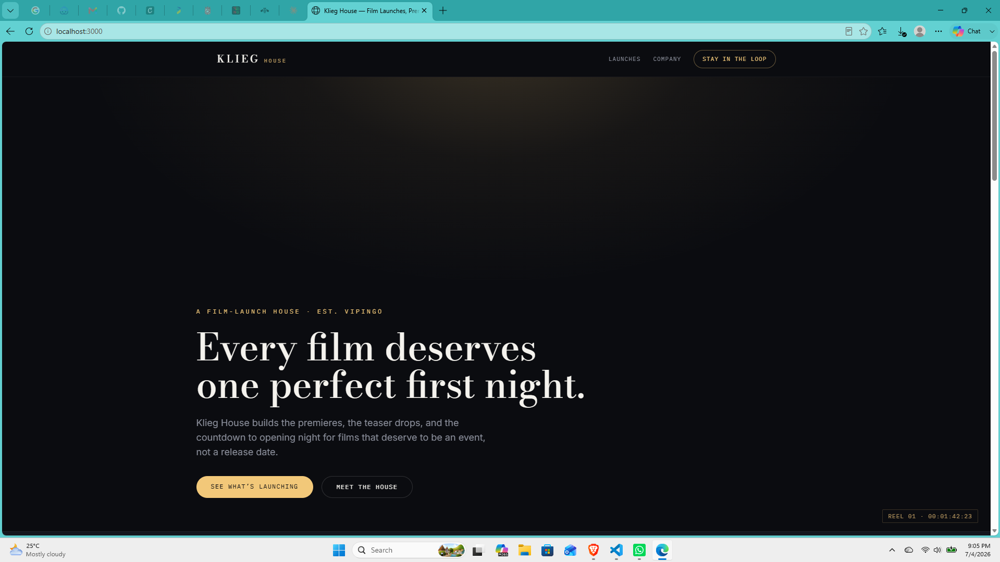
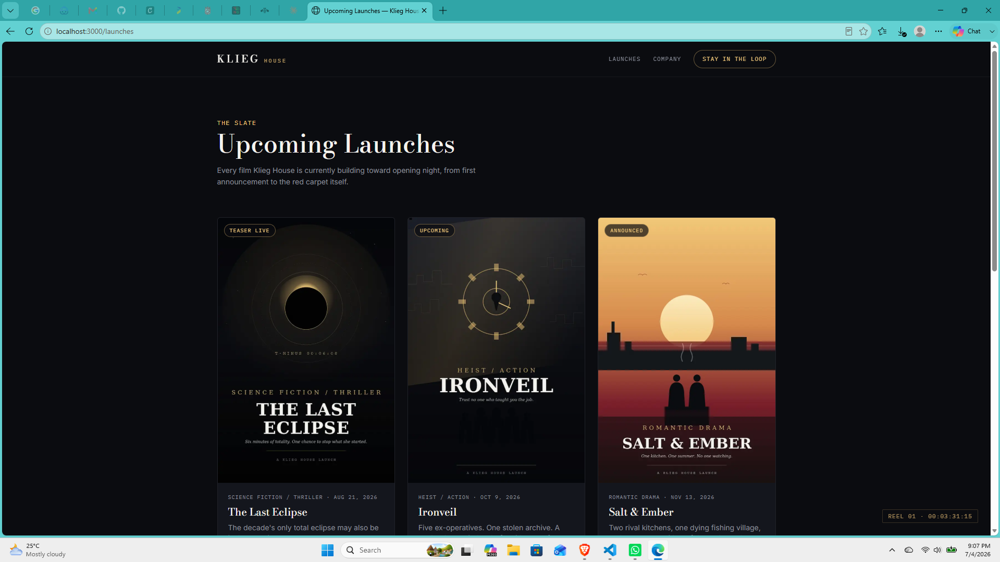
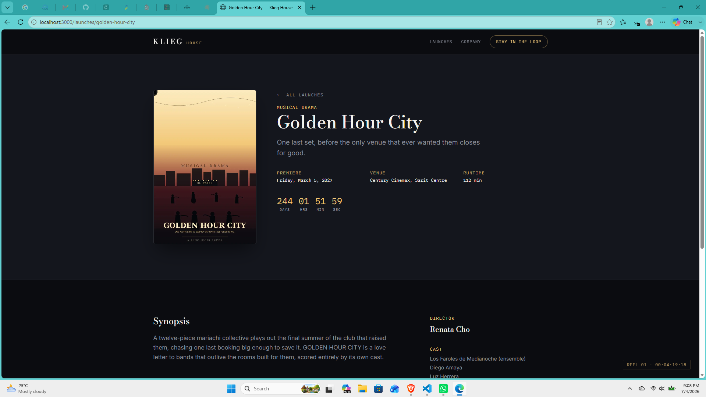
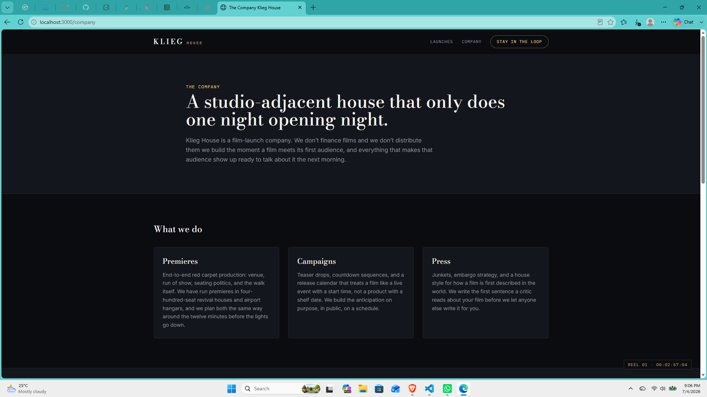

# Klieg House

> "We don't distribute films. We give them a first night worth remembering."

Klieg House is a fictional film-launch company  a studio-adjacent house that
builds premieres, teaser campaigns, and press days for films that deserve to
be an event. This repo is its website: a Next.js frontend served by its own
Laravel API.

**Repo layout — monorepo:**
```
klieg-house/
├── frontend/   Next.js 14 (App Router) the site itself
└── api/        Laravel  /api/films and /api/subscribers
└── docs/       documents /Images
└── README.md   README.md file
```

---

## Screenshots

| Page | Screenshot |
|---|---|
| Landing |  |
| Upcoming Launches |  |
| Film Detail |  |
| Company |  |

## Setup & Run

### API (Laravel)

```bash
cd api

composer install
cp .env.example .env
php artisan key:generate

# Using SQLite
touch database/database.sqlite

php artisan migrate
php artisan db:seed --class=Database\\Seeders\\FilmSeeder

php artisan serve
# http://localhost:8000/api
```

Quick check:

```bash
curl http://localhost:8000/api/films
```

### Frontend (Next.js)

```bash
cd frontend

npm install
cp .env.local.example .env.local
# Set NEXT_PUBLIC_API_URL=http://localhost:8000/api

npm run dev
# http://localhost:3000
```

The frontend reads `NEXT_PUBLIC_API_URL` for all API requests, so the backend URL can be changed without modifying the code.

## Stack choices & trade-offs (built under a same-day deadline)

- **Monorepo, not two repos**  One clone and one PR history, making it easier to review the frontend and API together.
- **Laravel skeleton not vendored in git**  A standard Laravel project contains mostly framework
  boilerplate (bootstrap, configuration, `artisan`,`public/index.php`, etc.) that adds little value during review.
  This repository includes only the application-specific code (models, migrations, controllers, routes, seeders, and CORS configuration).
  The setup guide above scaffolds the remaining framework files
  The trade-off is one additional `composer create-project` step before running the API.
- **SQLite over MySQL/Postgres for local dev**  Chosen to provide a zero-configuration setup.
  The included `.env.example` can be easily updated to use MySQL if preferred.
- **Poster art is generated SVG, compiled to JPG for the frontend** five distinct treatments,
  one per film's genre, JPG is served by default; SVG is the fallback path.
- **Teasers use a public-domain sample video** A public-domain sample video from the Blender Foundation
  is used so the trailer player is fully functional instead of relying on placeholde
- **No test suite**  with the time budget,priority was given to implementing the required functionality
  and polishing the user experience
  
